# 逼落車 | Exit Rush (香城鐵路)

Mobile-first 3D crowd-exit game set on the fictional **香城鐵路 / Hong City Rail (HCR)**: get **off** the train while rush-hour crowds **force on** (逼上車). **Parody** of Hong Kong metro vibes (coloured stations, bilingual signs) — **original art & audio only**; not affiliated with MTR Corporation or any real railway. Station names are playful parodies (see [`docs/STATIONS.md`](docs/STATIONS.md)).

> Vertical slice (**v0.5.0**). Steam-store polish is the aspiration; v0.2 added real crowd physics, counterflow boarding, joystick + shove controls and a juice pass; v0.2.1 was a balance pass (see [`docs/BALANCE.md`](docs/BALANCE.md)); v0.2.2 was a bug-fix / mobile-robustness pass; **v0.3.0 was the art & icon pass**; **v0.5.0 short levels + special intros**; v0.4.1 added audio, per-station themes, and HK-style side-wall sliding doors** (car ends are gangways only — see below).

<p align="center">
  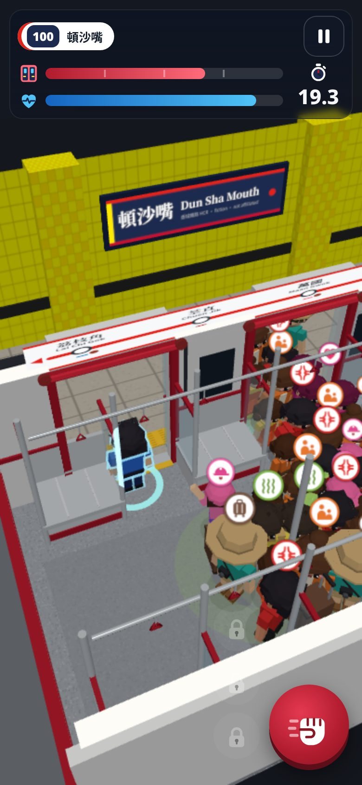
  
  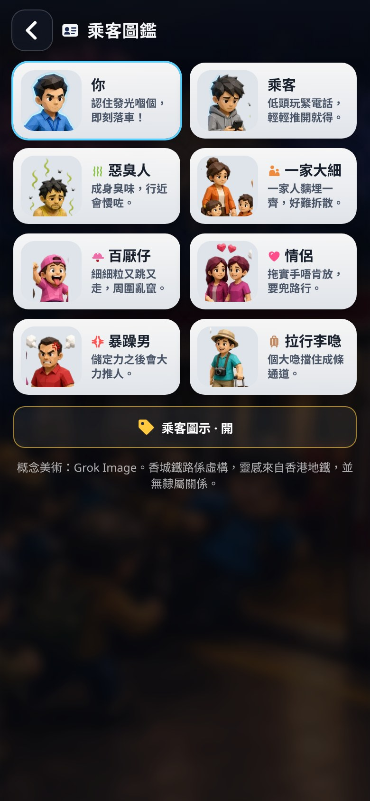
</p>
<p align="center">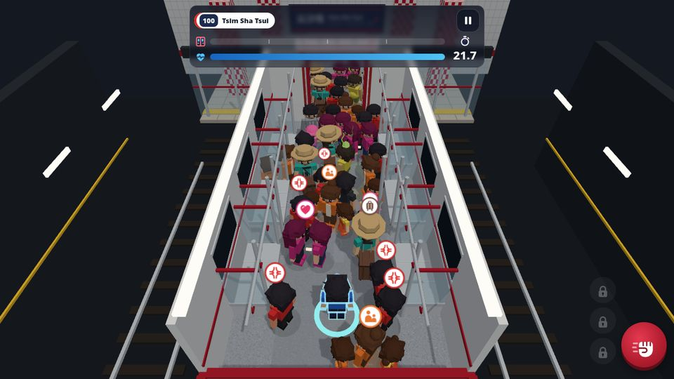</p>

<p align="center"><em>v0.4.1 — exits on the <strong>side wall</strong> (left); car ends are gangways. Screenshots: mid-run crowds boarding through open doors.</em></p>

## v0.5.0 — short exits & teach specials

- **~10–15 s levels** (1–30 + 100): L1–5 normals only; specials introduced at **6 / 9 / 12 / 15 / 18 / 21** with intro cards (EN + 粵), then two reinforce levels each; mixes on 24–30.
- **FTUE:** first launch auto-starts L1 with a ghost-hand drag hint.
- **L100 locked** until level **30** is cleared.
- **Skill points:** **+3** on first clear only (replay farm removed). 31 × 3 = 93 SP reachable.
- Screens: [`docs/screens-v05/`](docs/screens-v05/).

<p align="center">
  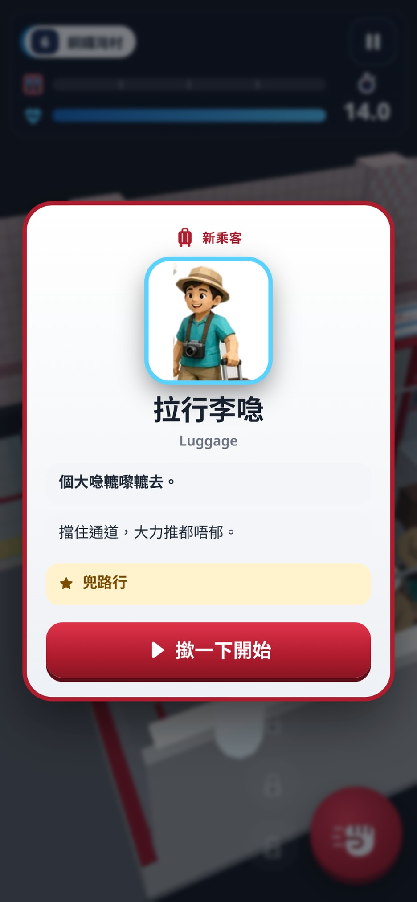
  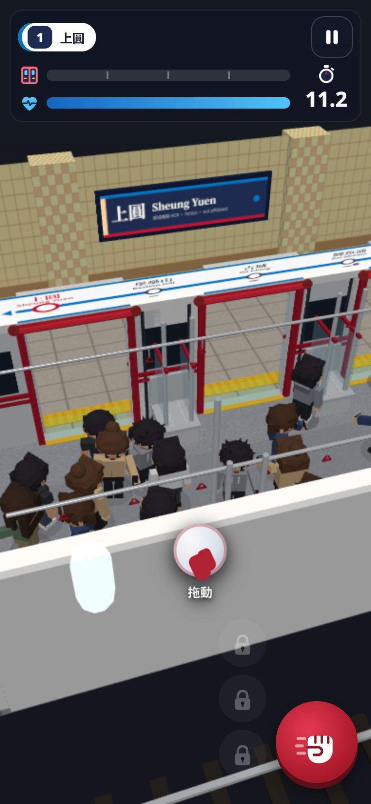
  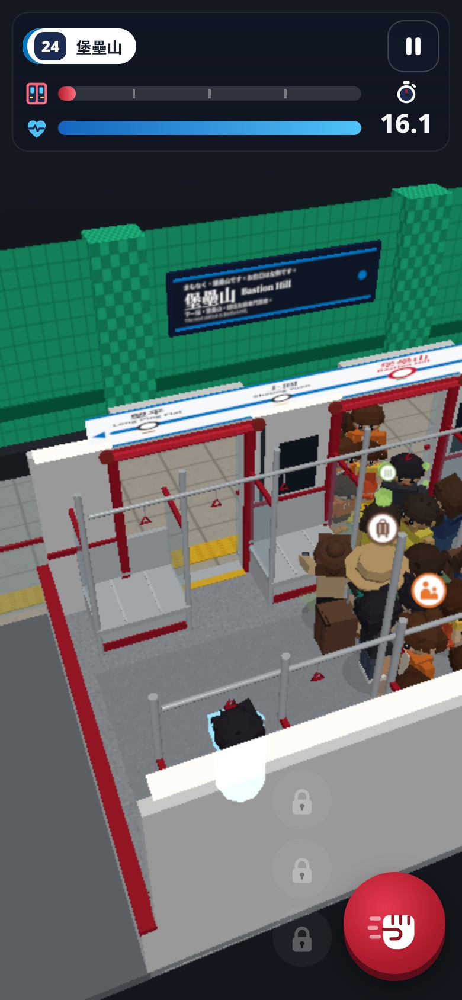
  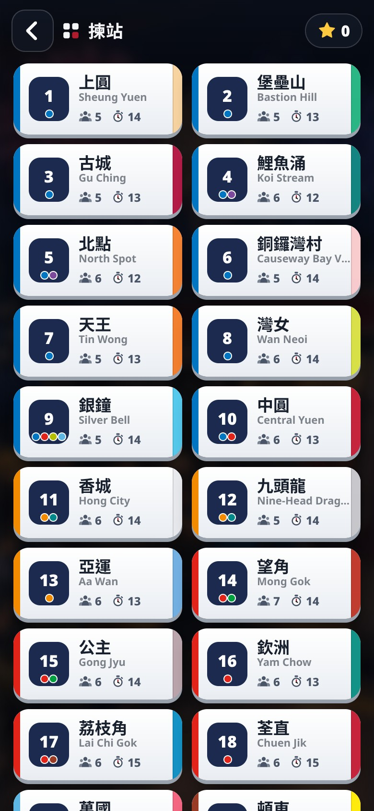
</p>

## v0.4.1 audio, station themes & side doors

- **Side-wall sliding doors:** exits open on the left long wall onto the platform; fewer open door bays on higher levels. Car ends are gangways, not exits.
- **Fictional operator:** 香城鐵路 / Hong City Rail (HCR). Parody station & line names — mapping in [`docs/STATIONS.md`](docs/STATIONS.md).
- **Original metro-style SFX** (Web Audio synthesis only — **no real-railway recordings**): rapid two-tone door-closing warning synced to the last-5s beeps; multi-note arrival jingle; doors open whoosh/hiss + thunk; departure rumble; crowd murmur ambience scaled by density (plus distant fireworks pops on L100); UI clicks; skill-point chime; win jingle / lose buzzer; stylised station-announce chime (no cloud TTS — bilingual sign flash instead).
- **Mixer:** master / music / sfx volumes + mute toggle (menu + pause), persisted in the save (`masterVol`, `musicVol`, `sfxVol`, `muted`; old saves get defaults). Still respects visibility-pause suspend and iOS unlock.
- **Per-station visual themes** (`src/game/stationThemes.ts`): wall/pillar tile colour, accent, line colour and lettering style for all 21 playable stations. Platform pillars and back wall follow the station colour; the strip map highlights the line colour; level cards show a station-colour swatch.
- **Fonts (SIL OFL):** subset `Noto Sans CJK HK Bold` + `Noto Serif CJK HK Bold` woff2 under `public/fonts/` (~115 KB total) for station-sign canvas textures (serif for classic 香島/荃直 lettering, sans for modern lines). Licence: `public/fonts/OFL-Noto.txt`. **No proprietary railway fonts.**


<p align="center">
  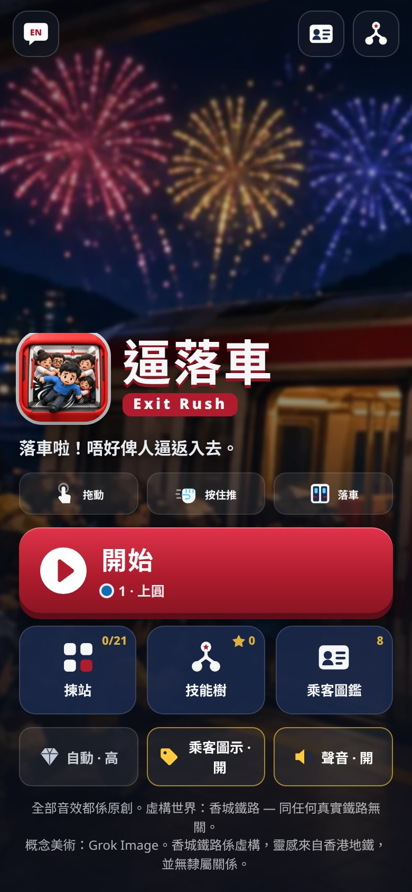
  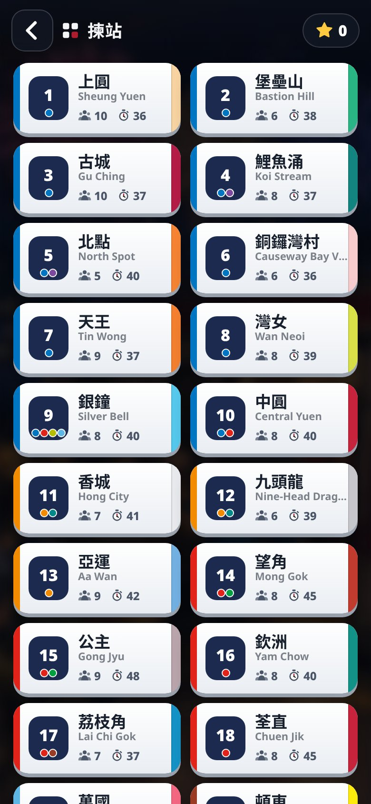
  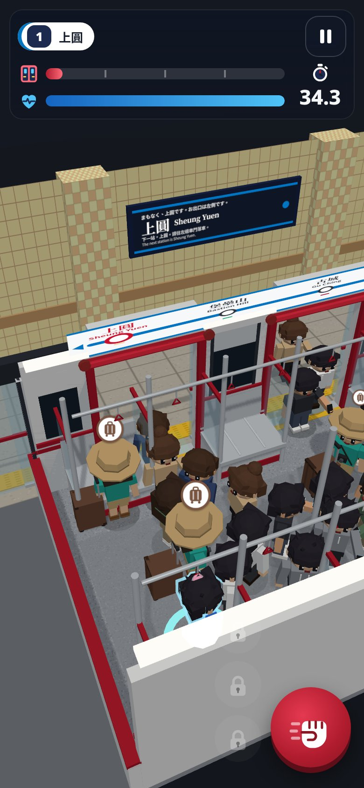
  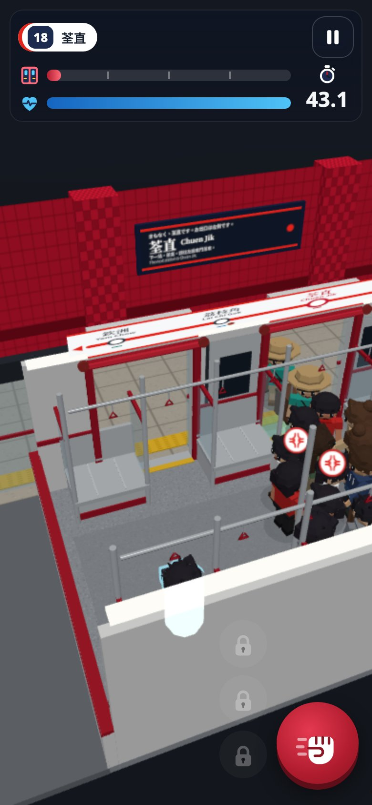
  
</p>

## How to run


```bash
cd hk-mtr-exit-rush
npm install
npm run dev      # http://localhost:5173 — best on phone or Chrome device toolbar
npm run build    # production bundle → dist/
npm run preview  # serve dist/
npm run test:sim # headless physics + level-balance check (bot plays every level)
RUNS=40 npm run test:sim   # balance-grade sample — see docs/BALANCE.md for options
```

Touch / mouse: **drag anywhere** (floating joystick) to steer, **hold the fist button** to charge a shove and release to burst. Tap ult icons (when unlocked) during a run. Toggle **EN / 粵** from the menu bar or the pause menu.


## Play on iPhone

Live build (GitHub Pages): **https://kingsleykwan.github.io/hk-mtr-exit-rush/**

1. Open the link in **Safari** on your iPhone.
2. Tap the **Share** button → **Add to Home Screen**.
3. Keep the name **逼落車** (or rename) → **Add**.
4. Launch from the home-screen icon for a full-screen standalone app (notch-safe, `viewport-fit=cover`).

The Pages deploy builds with `BASE_PATH=/hk-mtr-exit-rush/` so assets resolve under that subpath. Local `npm run dev` still serves at `/`.

## Controls

| Input | Action |
|--------|--------|
| Drag anywhere (floating joystick) | Steer / push toward exit (small aim-assist toward gaps; stronger with WIS) |
| Hold fist button → release | Charged shove burst (stamina cost, short cooldown) |
| STR / SPD / WIS ult buttons | Ultimates (if unlocked): shockwave · dash · path sense (10 s cooldown) |
| Keyboard | WASD / arrows steer · Space = shove · 1/2/3 = ults · P / Esc = pause |
| 粵 / EN glyph | Language toggle EN ↔ 粵 |
| Skill-tree icon | Skill tree — from the menu, or from the pause / result overlay (returns to the run) |
| Passenger-card icon | Passenger legend (portrait + name + tip for all 8 types) |
| Gem button | Graphics quality: Auto / Low / High (menu) |
| Tag button | Floating passenger-type icons on / off (menu, legend) |

## v0.3.0 art & icon pass

- **Concept art → game.** Style target, app icon and key art were **generated with Grok Image** (sources not in the repo; pipeline in [`scripts/art/build_art.py`](scripts/art/build_art.py) → `python3 scripts/art/build_art.py --src <dir>`). It crops the app icon to a full-bleed square (1024 store copy + 512/192/180 apple-touch/32 favicon, no transparency), compresses the key art to WebP for the title backdrop, cuts 8 passenger portraits into one alpha WebP strip for UI cards, and writes Steam-capsule-style crops (`store/capsule-1920x1080.jpg`, `store/capsule-460x215.jpg`). Added build assets ≈ 0.3 MB.
- **Chunky chibi low-poly characters** (`src/game/characters.ts`): big heads with eyes/brows/mouth, hair shapes, torso, arms, legs, all merged into one flat-shaded, vertex-coloured geometry per look and drawn with one `InstancedMesh` per look (shared `MeshLambertMaterial`). Per-type silhouettes match the concept lineup: hero (blue shirt + lanyard, cyan glow shell + x-ray outline through the crowd), commuters (grey hoodie + phone, 6 colour variants), stench guy (yellow singlet, wavy green stink lines + flies), family (orange mum + 2 kids), brat (pink cap, small, bouncy), couple (matching magenta, joined hands, floating heart), angry man (red polo, anger vein + steam puffs during wind-up, red tint), tourist (sun hat, camera, big brown rolling suitcase). Waddle/bob, lean, squash & stretch and hit-flash work through instance matrices/colours.
- **Floating type icons** (billboards) above special passengers near you (≈3.4 m) and above any angry man winding up; toggle in the menu / legend.
- **HCR metro-style car** (original, no logos; **v0.4.1 side doors**): white interior, red stripe, stainless longitudinal benches between door bays, glass partitions, vertical poles, overhead rails with red grips. **Sliding exits sit on the left (−X) long wall** (platform side) with red frames + door-indicator lights; **car ends are gangways only** (not exits). Line-map strip above the door wall (stations from the level's line, bilingual), yellow edge line, platform screen doors, station-coloured tiled pillars and a navy bilingual station sign using the level's `stationEn` / `stationZh`; dark tunnel + neighbouring track on wide screens. Static geometry is merged by material (~a dozen draw calls).
- **Icon-first UI** (`src/ui/icons.ts`): one authored, bold, rounded, filled SVG set (door, stamina, timer, shove, STR/SPD/WIS, skills, 粵/EN, pause/play/restart/home, quality, star, lock, crowd, legend, per-type glyphs) in HCR red / white / navy — no more emoji. New title screen over the key art, compact level cards (number badge with line dots, station 中/EN, density + timer icons, ✓), new **passenger legend** screen, icon HUD, round icon buttons on pause / win / lose.
- **Low quality** drops stink lines, flies and some puffs; High keeps them. Measured in headless Chrome (SwiftShader software GL, 390×844 @3x): L100 Low ≈ 25 fps with ~80 bodies, ~97 draw calls, ~47k triangles; High ≈ 6 fps there because software GL renders shadows + AA at DPR 2 on the CPU — real GPUs are far faster.
- Saves unchanged (new `typeIcons` field defaults to on); skill tree, levels, physics, quality and i18n untouched apart from the new strings (EN + zh-HK).

## v0.2.2 fixes

- **Skill tree no longer abandons the run.** Opening it from pause (or the win/lose overlay) shows it as an overlay; **Back** returns to the paused run. Points spent mid-run apply from the **next run** (retry / next level) — the current run keeps the loadout it started with, and the panel says so. Only the explicit **Menu** button leaves a run.
- **Auto-pause when backgrounded.** `visibilitychange` (hidden), `pagehide` and window `blur` pause a running level; the AudioContext is suspended while hidden and resumed on return. The game stays paused (with a "paused while you were away" note) until you tap Resume.
- **Saves never throw.** `loadSave`/`writeSave` are wrapped; if storage is blocked (Safari private mode, quota) progress is kept in memory for the session and a one-time toast says it can't be saved. Old saves load unchanged (new fields get defaults).
- **`<html lang>`** follows the EN / 粵 toggle.
- **All UI copy in the dictionaries** (`src/i18n/en.ts`, `zh-HK.ts`), incl. level teaser, skill how-to, “Ult”, seconds unit; a few zh-HK strings made more natural written Cantonese.
- **Graphics quality setting** (persisted, default **Auto**):
  - *High* = previous look: antialias, PCF shadow map, pixel ratio min(DPR, 2).
  - *Low* = no shadow map (cheap blob shadows remain), no antialias, pixel ratio 1.
  - *Auto* starts from device hints (low if `deviceMemory` ≤ 4 GB, ≤ 4 CPU cores, or DPR ≥ 3 with ≤ 6 cores), then a ~2.5 s FPS probe drops High → Low if it averages < 45 fps. The result is cached in the save so later launches create the WebGL context with the right antialias setting. Shadows / pixel ratio switch live; antialias is fixed per WebGL context, so an AA change applies after a reload (the menu notes this).
- **Crowd rendering:** passenger heads and blob shadows are now two shared `InstancedMesh`es (bodies keep a per-agent material for hit flashes); geometries/materials are shared; level restart clears and disposes per-agent objects and reuses the instanced pools (verified: renderer memory stays flat across repeated restarts).
- **Skill-point economy (stop-gap):** with only 21 playable levels, a level now awards a point on its first clear **and on replays, up to 5 points per level** (`MAX_POINTS_PER_LEVEL` in `SkillTree.ts`) → 105 points reachable, enough for a full branch + ultimate and the ~99-point L100 loadout. Set it back to 1 when levels 21–99 ship.
- Mobile polish: brand bar hidden during a run (HUD moves up under the notch), safe-area insets on all sides, every button ≥ 44 px, `prefers-reduced-motion` followed live, three.js split into its own cached chunk.

## Status (v0.5.0)

| Area | Status |
|------|--------|
| Train car + door + platform scene (Three.js) — HCR metro-style interior, PSDs, bilingual station sign | ✅ v0.3 |
| Chibi low-poly characters, 8 passenger types, instanced; type icons | ✅ v0.3 |
| Authored SVG icon set, title / level select / passenger legend screens, app icon + key art | ✅ v0.3 |
| Crowd physics: mass, velocity/damping, soft contacts, spatial hash, 60 Hz fixed step | ✅ v0.2 |
| Counterflow boarders (逼上車) + crowd compression / relaxation | ✅ v0.2 |
| Distinct per-type physics (angry shove, couple spring, family cohesion, stench aura, luggage) | ✅ v0.2 |
| Floating joystick + hold-to-shove + WIS gap aim-assist | ✅ v0.2 |
| Juice: camera lag/shake/kick, squash & stretch, puffs, hit-stop, vignettes, haptics | ✅ v0.2 |
| Door-closing warning (flashing lights, accelerating beeps, leaves physically close) | ✅ v0.2 |
| Ultimates: STR shockwave · SPD dash + afterimages · WIS path highlight | ✅ v0.2 |
| Headless sim test (`npm run test:sim`) | ✅ v0.2 |
| Levels **1–30 + 100** playable, short timers, staged specials; L100 needs L30 clear + strong skills (~93 SP cap) | ✅ v0.5 |
| HUD (door progress + milestones, stamina, timer, cooldowns) | ✅ |
| Skill tree (overlay from pause, returns to run) + localStorage with in-memory fallback | ✅ v0.2.2 |
| Auto-pause on background / blur, audio suspend & resume | ✅ v0.2.2 |
| Graphics quality Auto / Low / High (FPS probe), instanced crowd heads/shadows | ✅ v0.2.2 |
| i18n EN + zh-HK (all UI strings in dictionaries, `<html lang>` synced) | ✅ v0.2.2 |
| Original metro-style Web Audio SFX + mixer + mute | ✅ v0.4 |
| Per-station wall/pillar themes + OFL sign fonts | ✅ v0.4 |
| Levels 31–99 content | 📝 TBD (see `docs/LEVELS.md`) |
| Balance pass: crowd drag, skill-point scaling, ult parity (SPD dash toned down), multi-run sim harness | ✅ v0.2.1 |
| Capacitor / App Store (native haptics) | ⏳ Roadmap |
| Further foley / optional offline JA TTS | ⏳ jingle + sign flash shipped |

Physics & feel tuning knobs live in [`src/game/sim/tuning.ts`](src/game/sim/tuning.ts) (also `window.TUNING` in dev / `?debug`). See [`docs/GAME_DESIGN.md`](docs/GAME_DESIGN.md#physics--feel).

## Roadmap

1. **Content** — Fill levels 31–99; polish level 100 (十一煙花後頓沙嘴).
2. **Feel** — Animated low-poly characters, per-type SFX, native haptics via Capacitor; playtest the v0.2.1 curve with humans.
3. **Audio** — ✅ v0.4 original synthesised metro-*style* cues (never use real-railway audio). Further polish / foley welcome.
4. **Mobile wrap** — Capacitor → iOS / Android. **App Store requires an Apple Developer account** ($99/yr).
5. **Polish** — Limb animation (walk cycles), station announcement style UI, accessibility (colourblind patterns), tutorials, store screenshots.

## Docs

- [`docs/GAME_DESIGN.md`](docs/GAME_DESIGN.md) — full design
- [`docs/LEVELS.md`](docs/LEVELS.md) — station / difficulty draft
- [`docs/BALANCE.md`](docs/BALANCE.md) — v0.2.1 balance table + how to rerun the sim

## License / assets

Code: project-owned. Visuals & audio are **original** and inspired by HK metro aesthetics — not affiliated with any real railway; no real-operator logos or audio. Concept art, app icon and key art were **generated with Grok Image**; in-game 3D characters and the scene are built in code from primitives; UI icons are hand-authored SVG.

## No secrets

Do not commit `.env`, keys, or credentials. See `.gitignore`.
